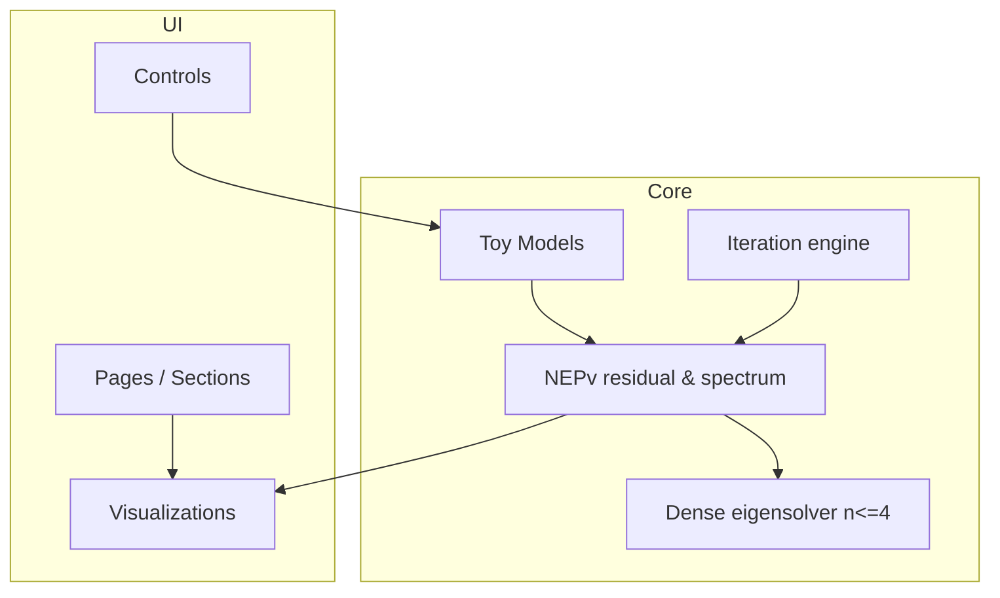

# NEPv Interactive Visualization Teaching Site — Product Requirements Document (PRD)

| Field | Value |
|-------|--------|
| **Document version** | v1.2 |
| **Status** | Draft |
| **Product name** | NEPv Lens / Eigenvector-Dependent Explorer |
| **Project type** | Portfolio / course demo — math visualization + front-end engineering + AI-assisted research |
| **Audience** | Implementer, reviewers (math / front-end / AI usage), end learners |

---

## 1. Purpose and scope

### 1.1 Purpose

Turn the competition / assignment brief into an executable product spec: **what to build, what not to build, and how to accept delivery**, so a demonstrable, reproducible, mathematically honest public GitHub project ships on time.

### 1.2 In scope

- Product vision, users, functional / non-functional requirements, content rules, technical approach, report structure, milestones, risks.

### 1.3 Out of scope

- Full mathematical proofs, industrial NEPv solvers, large-scale HPC integration.

### 1.4 Related deliverables

| Deliverable | Path / form | Notes |
|-------------|-------------|--------|
| Runnable web app | Repository root | `clone → install → run` |
| README | `README.md` | Install, run, design, limits, citations |
| AI usage | `docs/AI_USAGE.md` | How AI helped; human / code verification |
| Project report | `REPORT.md` | Problem / Methodology / Evaluation / Results |
| Optional demo | `docs/assets/demo.gif` | Embed in README |

---

## 2. Background and problem statement

### 2.1 Context

**Nonlinear eigenvalue problems with eigenvector dependency (NEPv)** appear in physics, engineering, and data science, yet most learners lack intuition: the eigenvector \(x\) is not only unknown—it **changes** the operator \(A(x)\) in \(A(x)x=\lambda x\).

Standard linear tools (fixed-matrix `eig`) **do not apply directly**. Iteration geometry, multiple solutions, and basins of attraction can be subtle. Existing material is mostly papers and formulas, with few **hands-on** small-scale visual entry points.

### 2.2 Problem statement

> **How can we use an original, interactive, mathematically accurate experience so learners with basic linear algebra build core NEPv intuition in 5–15 minutes, while honestly seeing common pitfalls and demo limitations?**

### 2.3 Product positioning

- **Type:** Teaching / exploration SPA (not SaaS, not a production solver).
- **Value:** Turn “\(A\) depends on \(x\)” into something visible, draggable, and comparable.
- **Differentiation:** Original visualization narrative + small verifiable numerics + explicit limits—not generic scatter plots or formula walls.

---

## 3. Goals and non-goals

### 3.1 Objectives

| ID | Objective | Measurable outcome |
|----|-----------|-------------------|
| O1 | **Teaching clarity** | New users complete the guided flow and restate key NEPv vs linear EVP differences |
| O2 | **Mathematical honesty** | Major UI claims trace to definitions or code/tests |
| O3 | **Original interaction** | ≥1 core pattern reviewers recognize as the main metaphor (§6) |
| O4 | **Reproducibility** | Reviewer runs local demo in ~10 min via README |
| O5 | **AI transparency** | Document AI-assisted steps and verification checklist |

### 3.2 Success metrics

**Review-facing (mostly qualitative):**

- Originality: main interaction reflects “\(A(x)\) moves with \(x\)”.
- Rigor: notation, residual, normalization consistent.
- Front-end craft: readable layout, basic mobile support, smooth at 2×2–4×4 scale.

**Self-check (quantitative):**

- First visit → drag \(x\) and see residual/spectrum change: **< 3 min**.
- First `npm run dev` (excluding install): **< 2 min**.
- Lighthouse accessibility ≥ 85 (optional).

**Hard checks (aligned with §14):**

| Dimension | Metric | Threshold |
|-----------|--------|-----------|
| Math honesty | UI residual formula vs `src/math/nepv.ts` | **100% match** |
| Math honesty | Unit tests vs §5.3 baselines | error **≤ 1e-6** |
| Reproducibility | Clean Win / macOS / Linux or Docker | **100%** (record in `AI_USAGE` or REPORT) |

### 3.3 Out of scope

- New theory or paper-level algorithms.
- Arbitrary dimension, large sparse matrices, distributed solvers.
- Accounts, cloud save, collaboration.
- LLM chat as core product (AI for research/docs only; see §11).
- Claims that demo results generalize to all NEPv instances.

---

## 4. Users and scenarios

### 4.1 Personas

| Role | Background | Goal | Pain |
|------|------------|------|------|
| **Learner L** | Undergrad linear algebra | NEPv definition + geometry | Papers, no visual entry |
| **Reviewer R** | Math + front-end + AI | Judge quality in ~10 min | Generic static pages |
| **Developer D** | Full-stack / front-end | Shippable artifact + report | Tight time, confused definitions |

### 4.2 User stories

| ID | Story | Acceptance |
|----|-------|------------|
| US-1 | As L, compare NEPv vs \(Ax=\lambda x\) in ~2 min | Side-by-side or toggle on same toy |
| US-2 | As L, drag \(x\) and see \(A(x)\), residual, spectrum | Main controls update together |
| US-3 | As L, see fixed-point / iteration toward a solution | Optional: step/play + trajectory |
| US-4 | As L, see why “freeze \(A\)” is wrong | Pitfall panel or one-click contrast |
| US-5 | As R, run locally from README | Copy-paste commands work |
| US-6 | As R, see references + AI usage | README + REPORT links complete |

### 4.3 Happy path

```mermaid
flowchart LR
  A[Landing: what is NEPv] --> B[Choose toy model]
  B --> C[Explore: drag x or parameters]
  C --> D[See A(x), residual, spectrum / iteration]
  D --> E[Pitfalls: linearization mistake]
  E --> F[Methods and limitations]
  F --> G[References]
```

Typical session: **8–15 minutes** including reading.

---

## 5. Mathematical and content rules (mandatory)

### 5.1 Standard form (fixed in UI)

**Primary display:**

\[
A(x)\, x = \lambda x, \quad x \in \mathbb{C}^n \setminus \{0\}
\]

\(A: \mathbb{C}^n \to \mathbb{C}^{n\times n}\) (or real analogue) **explicitly depends** on \(x\).

**Relative residual (site-wide, normalized):**

\[
r_{\mathrm{rel}}(x,\lambda) = \frac{\|A(x)x - \lambda x\|_2}{\|A(x)x\|_2 + \|\lambda x\|_2}
\]

Implementation and tests use plain form:

```text
r_rel(x,λ) = ||A(x)x − λx||₂ / (||A(x)x||₂ + ||λx||₂)
```

**UI requirement:** Playground shows this formula permanently (KaTeX or monospace). Do not use a different formula in UI vs README.

(\(\|x\|=1\) constraint must appear in UI and README. Code may add \(\varepsilon \le 10^{-12}\) for division guard only.)

### 5.2 Distinctions (copy required)

| Concept | Form | In this product |
|---------|------|-----------------|
| Linear EVP | \(Ax=\lambda x\), fixed \(A\) | Comparison baseline |
| General NEP | \(F(\lambda,x)=0\) | Footnote; do not conflate |
| NEPv | \(A(x)x=\lambda x\) | **Focus** |
| Pseudospectrum toys | Operator families not tied to \(x\) | Not main narrative |

**Complex eigenvalues (real matrix, complex \(\lambda\)):**

- Conjugate pairs **must appear together**.
- Use real part for bar length; imaginary part as label (e.g. `±0.12i`).
- Connect conjugate bars with dashed line; legend “conjugate pair”.
- If only modulus available, split into \(a \pm bi\) rows.

### 5.3 Toy model library (implement ≥2)

**Model A — rank-one (2×2, default)**

\[
A(x) = A_0 + \alpha\, \frac{xx^\top}{\|x\|^2}
\]

**Teaching point:** small direction changes reshape \(A(x)\).

**Model A baseline** (\(A_0=\begin{bmatrix}1&0.3\\0.3&1.2\end{bmatrix}\), \(\alpha=0.6\); tests ≤ 1e-6)

| Field | Value |
|-------|--------|
| Default \(\alpha\) | 0.6 |
| Example \(x\) | \([0.848559,\;0.529101]^\top\) (normalized from \([0.85,0.53]^\top\)) |
| \(A(x)\) | \(\begin{bmatrix}1.432031 & 0.569384 \\ 0.569384 & 1.367969\end{bmatrix}\) |
| Spectrum of \(A(x)\) | \(\lambda_1 \approx 1.970284,\;\lambda_2 \approx 0.829716\) |
| \(r_{\mathrm{rel}}\) at \(\lambda=1.5\) | \(\approx 0.139536\) |

**Model B — diagonal scaling (3×3)**

\[
A(x) = \mathrm{diag}(a_1(x), a_2(x), a_3(x)), \quad a_i(x) = a_i^{(0)} + \beta_i\, |x_i|^2
\]

**Model B baseline** (\(a^{(0)}=[1,2,0.5]^\top\), \(\beta_1=1,\beta_2=0.8,\beta_3=1.2\))

| Field | Value |
|-------|--------|
| Example \(x\) | \([0.502519,\;0.703526,\;0.502519]^\top\) |
| \(A(x)\) | \(\mathrm{diag}(1.252525,\;2.395960,\;0.803030)\) |
| Spectrum | same as diagonal entries |
| \(r_{\mathrm{rel}}\) at \(\lambda=1.5\) | \(\approx 0.218824\) |

**Singularity rule (all models):**

| Condition | UI behavior | Message (i18n key `singularity.zeroX`) |
|-----------|-------------|----------------------------------------|
| \(\|x\|_2 < 10^{-12}\) | Disable compass / params | `x cannot be zero vector (||x||=1 enforced)` |

**Model C (optional) — nonsymmetric 2×2**

State-dependent off-diagonals; complex \(\mu_i\) for conjugate-pair UI rules.

Each model exports: `A(x)`, parameter schema, singularity notes, defaults, README limitation line.

### 5.4 Content red lines

- Never claim the demo “solves all NEPv”.
- Never call eig of frozen \(A(x_0)\) NEPv solving unless labeled **pitfall**.
- State equivalence class of \(x\) (scale / phase); UI uses \(\|x\|=1\).
- Complex eigenvalues: follow §5.2 pairing rules.

---

## 6. Functional requirements

### 6.1 Information architecture

```
/  (single page, anchor nav)
├── Intro band: Definition + Compare
├── Playground (core lab)
│   ├── Compass, observe (heatmap + spectrum), polar plot, iteration
│   ├── Setup drawer (model, params, λ guess, freeze pitfall)
│   └── Residual formula banner
├── AI Math Tutor (full width below lab)
├── Pitfalls & FAQ
└── References (collapsible) + footer
```

### 6.2 Feature list (MoSCoW)

#### Must have (P0)

| ID | Feature | Description | Acceptance |
|----|---------|-------------|------------|
| F-01 | Definition | \(A(x)x=\lambda x\), residual, vs linear EVP | Matches §5 |
| F-02 | Toy playground | ≥1 model; change \(x\) or params | UI feedback <100ms (n≤4) |
| F-03 | Operator viz | Small-matrix heatmap | Matches model code |
| F-04 | Spectrum + residual | Instantaneous \(\mu_i\), \(r_{\mathrm{rel}}\) | §5.1; formula visible |
| F-05 | Pitfall mode | Freeze \(A\) vs true \(A(x)\) | Toggle + warning chrome |
| F-06 | References | ≥3 credible sources | Links work |
| F-07 | README | clone/install/run/design/limits/AI | Third party runs |
| F-08 | REPORT.md | Problem, Methodology, Evaluation, Results | Matches implementation |

#### Should have (P1)

| ID | Feature | Acceptance |
|----|---------|------------|
| F-09 | Second toy model | Switch without crash |
| F-10 | Iteration lab | Step/play, trajectory, diagnostics |
| F-11 | Residual landscape | \(r(\theta)\) on unit circle |
| F-12 | Guided tour | 4 steps, skippable |
| F-13 | Demo GIF | 15–30s in README |

#### Could have (P2)

| ID | Feature |
|----|---------|
| F-14 | URL deep links |
| F-15 | Export screenshot/CSV |
| F-16 | Dark mode |
| F-17 | i18n (EN + zh-CN + zh-TW) |

#### Won't have (this release)

- Sparse upload / arbitrary \(n\)
- User accounts
- Real-time LLM chat as core

### 6.3 Core interaction — “Coupling Compass”

**Metaphor:** \(x\) is the compass needle; \(A(x)\) is terrain that rotates with the needle; eigenvalues are the “slope spectrum” at the current terrain.

| Element | Behavior | Priority | Latency (n≤3) |
|---------|----------|----------|----------------|
| 2D compass | Drag → \(x\), auto \(\|x\|=1\) | Highest | **≤ 50 ms** |
| λ slider | Guess \(\lambda\), show \(r_{\mathrm{rel}}\) | Medium | **≤ 80 ms** |
| Pitfall toggle | Frozen vs dynamic spectrum | Medium | **≤ 100 ms** |
| Heatmap | Live \(A(x)\) | Linked to compass | ≤ 50 ms |
| Spectrum bars | Eig of **current** \(A(x)\); label “instantaneous spectrum” | Linked | ≤ 50 ms |

**Compass edge case:** drag outside circle → project + normalize; toast `x normalized to unit sphere` (3s).

**Pitfall on:**

- Red ⚠ badge + text: `Linearized approximation: A fixed at x₀, not true NEPv solution`
- Tooltip: ignores \(A(x)\) dependence; residual is for linear EVP.
- Keyboard: `aria-describedby` on control.

**Linkage:** input change → recompute \(A(x)\) → spectrum + \(r_{\mathrm{rel}}\); animations 150–300ms must not break compass ≤50ms target.

### 6.4 Iteration lab (P1)

- Pick eigenvector of \(A(x_k)\) (max / min / closest-to-λ).
- Play / Step / Reset far / Reset to reference; max **200** steps.
- Stop when \(r_{\mathrm{rel}} < \varepsilon\) or \(\|x_{k+1}-x_k\|\) small.

| Condition | Behavior |
|-----------|----------|
| 200 steps and \(r > 10^{-3}\) | Auto-pause; banner `Iteration not converged: NEPv is initial-value sensitive` |
| Recovery | **Reset to reference initial guess** (§5.3 baseline \(x\), not random) |

---

## 7. Non-functional requirements

### 7.1 Performance

| Item | Requirement |
|------|-------------|
| Matrix size | \(n \le 4\) hard cap |
| Interaction | Visual update < 50ms target (n≤3) |
| Bundle | Gzipped JS < 500KB (no heavy 3D) |

### 7.2 Compatibility

- Desktop: Chrome / Edge / Firefox (last two majors).
- Mobile: readable; core touch drag works.
- 1280×720 demo layout; 375px width readable.

**Mobile (375px):**

| Component | Rule |
|-----------|------|
| Compass | Touch + numeric \(x_1,x_2\) dual control |
| Heatmap | Cell ≥ 40px; horizontal scroll if needed |
| Spectrum | Stacked vertically; keep all labels and conjugate dashes |

### 7.3 Accessibility

- Do not rely on color alone for spectrum/residual.
- Keyboard focus on main controls.
- Respect `prefers-reduced-motion` (P2).

### 7.4 Security

- Static site: no PII.
- Document third-party CDN if used; prefer npm bundles.

### 7.5 Maintainability

- Split `src/math/` and `src/components/`.
- One module per toy + unit tests.

---

## 8. Technical approach

### 8.1 Recommended stack

| Layer | Choice | Rationale |
|-------|--------|-----------|
| Framework | **Vite 8 + React 18** | Fast dev, easy static deploy |
| Numerics | Dense eig (n≤4), optional mathjs | Small matrices only |
| Viz | Custom SVG + CSS heatmap | No heavy 3D for P0 |
| Styles | CSS modules / design tokens | Teaching layout control |
| Tests | **Vitest** | Residual + baselines |
| Deploy | GitHub Pages / Vercel | README-documented |

**Pinned versions (implement in `package.json`):**

| Dependency | Version |
|------------|---------|
| Node.js | **≥ 18.17.0** |
| react / react-dom | **18.2.0** |
| vite | **8.x** |
| @vitejs/plugin-react | **6.x** (compatible with Vite 8) |
| vitest | pinned minor |
| katex | pinned minor |

### 8.2 Architecture



### 8.3 Repository layout

```
nepv-lens/
├── README.md
├── REPORT.md
├── NEPv-Visualization-PRD.md
├── Dockerfile
├── docker-compose.yml
├── docs/
│   ├── ROADMAP.md
│   ├── AI_USAGE.md
│   └── manual-screenshots/
├── scripts/
│   ├── setup-env.sh
│   ├── verify-build.sh
│   ├── capture_manual_screenshots.py
│   └── generate_manual_docx.py
├── src/
│   ├── math/
│   ├── models/
│   ├── components/
│   └── i18n/
└── tests/
```

### 8.4 Numerical notes

- Flag near-degenerate clusters as “numerically sensitive”.
- Normalize \(x\) after each iteration step.
- Fix RNG `seed` for reproducible report figures.

---

## 9. Documentation requirements

### 9.1 README sections

1. One-liner + screenshot/GIF  
2. Minimal NEPv explanation  
3. Clone / install / run (Node version)  
4. Design decisions (Coupling Compass, toys)  
5. Limitations  
6. References  
7. AI usage → `docs/AI_USAGE.md`  
8. Live demo URL (optional)

**Docker fallback:** `Dockerfile` + `docker-compose.yml`; `docker-compose up` → browser on mapped port without local Node.

### 9.2 REPORT.md structure

| Section | Content |
|---------|---------|
| Problem Statement | Definition, teaching goal |
| Methodology | Toys, residual, iteration, viz, stack |
| Evaluation Dataset | Synthetic instances + parameter table |
| Evaluation Methods | Baselines, thresholds, convergence stats |
| Results | Figures/tables from real runs |
| Discussion | Limits, future work |
| References | Superset of README |

### 9.3 AI_USAGE.md template

See `docs/AI_USAGE.md` for the verification table (formulas, baselines, i18n, tests, report figures).

---

## 10. Visual and UX principles

- Body width ~72ch; KaTeX for math.
- One main question per viewport (define / play / pitfall / methods).
- Sequential colormap for spectrum/residual; pitfall uses warning border.
- Motion shows \(A(x)\) changed—not decorative 3D.
- Tone: pedagogical, cautious (“may”, “in this toy model”).

---

## 11. AI usage strategy

| Stage | AI allowed | Must verify |
|-------|------------|-------------|
| Literature | Summaries | Accurate citations |
| Model design | Toy suggestions | Residual checks |
| UI copy | Drafts | §5 notation |
| Code | Scaffolding | `npm test` + baselines |
| Report | Outline | Figures from real runs |

**Forbidden:** Unedited model output as README/REPORT body.

**Labeling:**

| Output | Requirement |
|--------|-------------|
| AI-generated code | Comment: `// AI-generated: … verified by … YYYY-MM-DD` |
| AI-assisted copy | Mark `AI-assisted, human-verified` |

---

## 12. Milestones

| Phase | Time | Output | Done when |
|-------|------|--------|-----------|
| M0 Research | Days 1–2 | Toys, notation, repo | Model A on whiteboard |
| M1 Core math | Days 3–4 | `nepv.ts` + tests | All green |
| M2 Core UI | Days 5–7 | Playground P0 | US-2 works |
| M3 Content | Days 8–9 | Pitfalls + compare | F-05 live |
| M4 Docs | Days 10–11 | README + REPORT + GIF | External run OK |
| M5 Release | Day 12 | GitHub Pages | Public URL |

(~12 working days part-time.)

---

## 13. Risks and mitigation

| Risk | Impact | Mitigation |
|------|--------|------------|
| NEP vs NEPv confusion | Review penalty | §5.2 + FAQ |
| Iteration diverges | Confusion | Step cap + “initial-value sensitive” |
| Unstable eig | Wrong plot | n≤4 + sensitivity flag + tests |
| Scope creep (3D/WebGL) | Delay | P0: heatmap + bars only |
| AI hallucination | Dishonesty | Checklist §9.3 |
| GH Pages 404 | Broken demo | Document Vite `base` |

---

## 14. Definition of done

### 14.1 Product

- [ ] Public GitHub repo  
- [ ] README verified by third party  
- [ ] Full toy loop: change \(x\) → \(A(x)\) + residual/spectrum  
- [ ] Pitfall demonstrable  
- [ ] ≥3 references; `docs/AI_USAGE.md`  
- [ ] `REPORT.md` complete and consistent  
- [ ] No mislabeled frozen-\(A\) as NEPv solve  

### 14.2 Engineering

- [ ] `npm run build`  
- [ ] Unit tests pass  
- [ ] Static deploy works  
- [ ] `verify-build.sh` (gzip < 500KB)  
- [ ] Win / macOS / Linux or Docker smoke test  

### 14.3 Unit test matrix

| Module | Cases | Pass |
|--------|-------|------|
| Residual | §5.1 formula | ≤ 1e-6 |
| Models A/B | \(A(x)\), spectrum, \(r_{\mathrm{rel}}\) | vs §5.3 |
| Eigensolver | 2×2, 3×3 diagonal | ≤ 1e-6 |
| UI formula | UI string vs `nepv.ts` | 100% match |

### 14.4 Brief alignment

| Brief | PRD |
|-------|-----|
| Original visualization | §6.3 |
| Mathematical rigor | §5, §6.4 |
| Front-end craft | §7, §10 |
| AI traceability | §9.3, §11 |
| Runnable GitHub | §9.1, §14 |

---

## 15. Open questions

| # | Question | Default |
|---|----------|---------|
| Q1 | Real-only vs complex plane for \(x\)? | Real 2D/3D; complex \(\lambda\) as modulus + phase |
| Q2 | SPA vs multi-route? | Single page, anchor nav |
| Q3 | WebGL required? | No for P0 |
| Q4 | Report language? | English REPORT + i18n UI (EN default) |

---

## 16. Appendix

### 16.1 Reference types (fill at implementation)

- NEPv / nonlinear eigenvalue surveys  
- Numerical linear algebra (sensitivity, power iteration)  
- Math visualization projects (interaction ideas only)

### 16.2 Minimum report artifacts

- **Fig. 1:** Model A residual vs direction on unit circle  
- **Fig. 2:** Frozen \(A\) vs true NEPv iteration  
- **Table 1:** Convergence over 10 random seeds  

### 16.3 Glossary

| Term | Meaning |
|------|---------|
| NEPv | \(A(x)x=\lambda x\), \(A\) depends on \(x\) |
| Residual | \(r_{\mathrm{rel}}\) per §5.1 |
| Pitfall | Treating \(A(x_0)\) as fixed linear operator |
| Toy model | Small teaching instance, not physical scale |

---

**Maintenance:** When interaction design changes, update §6.3 and §14 and record the reason in README “Design decisions” with date.
