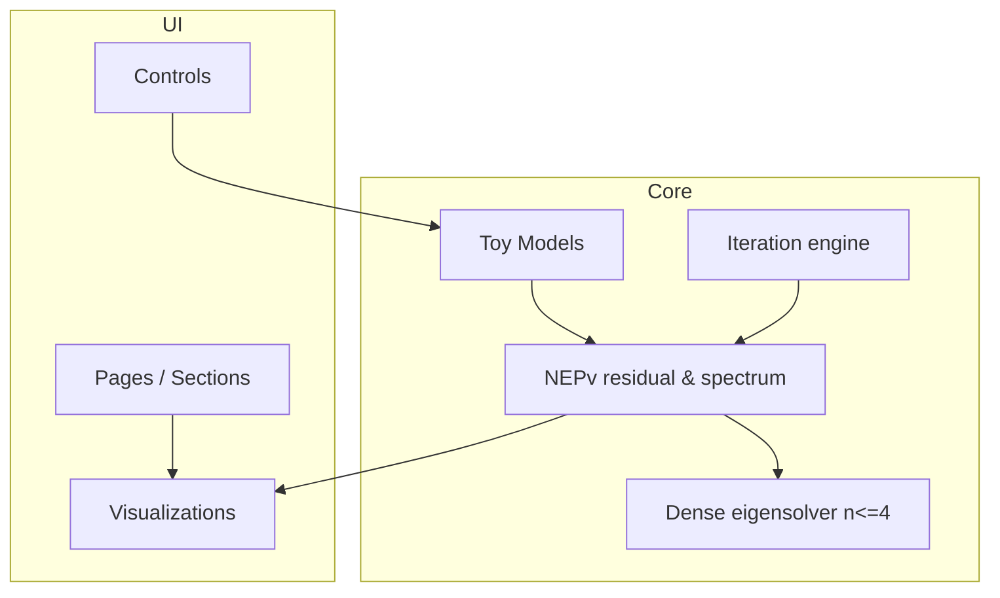

# NEPv 交互式可视化教学网站 — 产品需求文档（PRD）

| 字段 | 内容 |
|------|------|
| **文档版本** | v1.1 |
| **状态** | Draft |
| **产品名称（建议）** | NEPv Lens / Eigenvector-Dependent Explorer |
| **项目类型** | 招聘/课程展示型 — 数学可视化 + 前端工程 + AI 辅助研究 |
| **目标读者** | 本人（实现）、评审（数学/前端/AI 使用）、终端学习者 |

---

## 1. 文档目的与范围

### 1.1 目的

将竞赛/作业 brief 转化为可执行的产品规格，明确：**做什么、不做什么、如何验收**，以便在有限时间内交付可演示、可复现、数学上诚实的公开 GitHub 项目。

### 1.2 本文档范围

- 涵盖：产品愿景、用户、功能/非功能需求、内容规范、技术方案、报告结构、里程碑、风险。
- 不涵盖：完整数学证明、工业级 NEPv 求解器、大规模 HPC 集成。

### 1.3 关联交付物

| 交付物 | 路径/形式 | 说明 |
|--------|-----------|------|
| 可运行 Web 应用 | 仓库根目录 `/` 或 `web/` | `clone → install → run` |
| README | `README.md` | 安装、运行、设计、局限、引用 |
| AI 使用说明 | `README.md` 小节或 `docs/AI_USAGE.md` | AI 如何帮助、如何人工/代码验证 |
| 学术/项目报告 | `REPORT.md` 或 `docs/REPORT.md` | Problem / Methodology / Evaluation / Results |
| 可选 Demo | `docs/assets/demo.gif` | README 嵌入 |

---

## 2. 背景与问题陈述

### 2.1 业务/场景背景

**非线性特征值问题且算子依赖特征向量（NEPv, Nonlinear Eigenvalue Problem with eigenvector dependency）** 在物理、工程、数据科学等领域出现，但公众与多数工程师对其缺乏直觉：特征向量 \(x\) 不仅是被求解的未知量，还会**反过来改变**定义特征值方程的算子 \(A(x)\)。

标准线性特征值工具（固定矩阵的 `eig`）在此类问题上**不能直接套用**，迭代几何、多解性、收敛域可能非常复杂。现有材料多为论文与公式，缺少**可动手探索**的小规模可视化入口。

### 2.2 要解决的问题（Problem Statement）

> **如何用一种原创、可交互、数学标签准确的方式，让具备线性代数基础的学习者在 5–15 分钟内建立对 NEPv「算子随特征向量变化」的核心直觉，并诚实了解常见误区与 demo 局限？**

### 2.3 产品定位

- **类型**：教学/探索型单页或多页 Web 应用（非 SaaS、非生产求解服务）。
- **价值主张**：把「\(A\) 依赖 \(x\)」从抽象定义变成可看见、可拖动、可对比的交互体验。
- **差异化**：原创可视化叙事 + 小规模可验证数值实验 + 明确标注局限，而非通用随机散点或静态公式墙。

---

## 3. 目标与非目标

### 3.1 产品目标（Objectives）

| ID | 目标 | 可衡量结果 |
|----|------|------------|
| O1 | **教学清晰** | 新用户能在无口头讲解下完成引导流并复述 NEPv 与线性 EVP 的关键区别 |
| O2 | **数学诚实** | 页面上每个主要 claim 可在 README/报告追溯到定义或代码验证 |
| O3 | **交互原创** | 至少 1 个核心交互模式为评审可识别的「主视觉隐喻」（见 §6） |
| O4 | **工程可复现** | 评审按 README 在干净环境 10 分钟内跑起本地 demo |
| O5 | **AI 透明** | 文档说明 AI 辅助环节与人工/代码核验清单 |

### 3.2 成功指标（Success Metrics）

**评审向（定性为主）：**

- 原创性：主交互是否直接体现「\(A(x)\) 随 \(x\) 变」而非旁支图表。
- 数学严谨：符号、残差定义、归一化约定前后一致。
- 前端工艺：排版可读、移动端可基本浏览、无明显卡顿（2×2–4×4 规模）。

**自检向（定量建议）：**

- 首次访问 → 完成一次「拖动 \(x\) 并观察残差/谱变化」< 3 分钟。
- 本地 `npm run dev`（或等价）首次启动 < 2 分钟（不含 `npm install`）。
- Lighthouse 可访问性 ≥ 85（可选，非硬性）。

**量化项（与 §14 对齐，验收必查）：**

| 维度 | 指标 | 阈值 |
|------|------|------|
| **数学诚实** | UI 展示的残差公式与 `src/math/nepv.ts`（或等价实现）公式 | **100% 一致**（字符串/LaTeX 与代码注释对照） |
| **数学诚实** | 单元测试相对参考基线（§5.3 表） | 绝对误差 **≤ 1e-6** |
| **工程可复现** | Windows / macOS / Linux 干净环境按 README（或 Docker）跑通 | **100%**（至少各 1 台验证记录写入 `AI_USAGE` 或 REPORT） |

### 3.3 非目标（Out of Scope）

- 新理论证明、新算法论文级贡献。
- 任意维度、大规模稀疏矩阵、分布式求解。
- 用户账号、云端保存、协作编辑。
- 将 LLM 聊天作为产品核心（AI 仅用于研究与文档，见 §11）。
- 声称 demo 结果可推广到所有 NEPv 实例。

---

## 4. 用户与使用场景

### 4.1 用户画像

| 角色 | 背景 | 目标 | 痛点 |
|------|------|------|------|
| **学习者 L** | 本科/研一线代与特征值基础 | 理解 NEPv 定义与几何直觉 | 论文符号多、无可视入口 |
| **评审 R** | 数学 + 前端 + AI 使用 | 10 分钟内判断质量与诚实度 | 千篇一律的静态页 |
| **实现者 D（你）** | 全栈/前端 | 可交付、可写报告 | 时间紧、定义易混淆 |

### 4.2 核心用户故事

| ID | 故事 | 验收 |
|----|------|------|
| US-1 | 作为 L，我想在 2 分钟内看到 NEPv 与 \(Ax=\lambda x\) 的对比 | 有并排或切换说明 + 同一 toy 模型 |
| US-2 | 作为 L，我想拖动 \(x\) 并看到 \(A(x)\)、残差、特征值如何变 | 主画布/控制面板联动更新 |
| US-3 | 作为 L，我想看固定点/迭代法如何逼近解 | 可选：迭代步进 + 轨迹可视化 |
| US-4 | 作为 L，我想知道「若错误地固定 \(A\)」会错在哪 | Pitfall 面板或一键对比模式 |
| US-5 | 作为 R，我想按 README 本地运行 | 命令可复制、无隐藏步骤 |
| US-6 | 作为 R，我想看到引用与 AI 使用说明 | README + REPORT 链接完整 |

### 4.3 典型使用流程（Happy Path）

```mermaid
flowchart LR
  A[落地页: 什么是 NEPv] --> B[选择 Toy 模型]
  B --> C[Explore: 拖动 x 或参数]
  C --> D[观察 A(x), 残差, 谱/迭代]
  D --> E[Pitfalls: 线性化误区]
  E --> F[Methods: 算法与局限]
  F --> G[References]
```

预计单次会话：**8–15 分钟**（含阅读）。

---

## 5. 数学与内容规范（必须遵守）

### 5.1 标准问题形式（产品内统一记号）

**主形式（推荐在 UI 固定展示）：**

\[
A(x)\, x = \lambda x, \quad x \in \mathbb{C}^n \setminus \{0\}
\]

其中 \(A: \mathbb{C}^n \to \mathbb{C}^{n\times n}\)（或实情形 \(\mathbb{R}^n \to \mathbb{R}^{n\times n}\)）**显式依赖**未知向量 \(x\)。

**残差（用于着色/收敛，全站一致，采用归一化形式）：**

\[
r(x,\lambda) = \frac{\|A(x)x - \lambda x\|_2}{\|A(x)x\|_2 + \|\lambda x\|_2}
\]

等价 plain 记法（实现与单测以此为准）：

```text
r(x,λ) = ||A(x)x − λx||₂ / (||A(x)x||₂ + ||λx||₂)
```

**UI 强制**：Playground **右上角**（或 Metrics 面板顶栏）**永久可见**展示上述公式（KaTeX 或等宽文本，随语言切换文案、公式不变）；禁止仅在 README 定义而 UI 使用另一公式。

（特征向量约束 \(\|x\|=1\) 须在 UI 与 README 写明；分母加 \(\varepsilon\) 仅允许在代码中防除零，且 \(\varepsilon \le 10^{-12}\)，PRD/UI 不另给公式。）

### 5.2 与相关问题的区分（文案必含）

| 概念 | 形式 | 本产品中的处理 |
|------|------|------------------|
| 线性 EVP | \(Ax=\lambda x\)，\(A\) 固定 | 对比基准 |
| 一般 NEP | \(F(\lambda,x)=0\)，未必是 \(A(x)x=\lambda x\) | 脚注说明范围；不混称 |
| NEPv | \(A(x)x=\lambda x\) | **聚焦主题** |
| 伪谱/随机矩阵可视化 | 与 \(x\) 无关的算子族 | 不作为主叙事 |

**复特征值 UI 规则（实矩阵、复 \(\lambda\)，§5.3 谱图同规）：**

- 共轭对 **必须成对显示**，**禁止**单独展示一个复数特征值条目。
- 每一对：以 **实部** 驱动条形长度/主色；**虚部** 以数值标注（如 `±0.12i`）附于条旁。
- 共轭两条之间用 **虚线** 连接，图例注明「conjugate pair」/「共轭对」。
- 若实现仅能输出模长，须拆分为 \(\lambda = a \pm bi\) 两行，仍满足成对与虚线连接。

### 5.3 Toy 模型库（PRD 建议实现 ≥2 个）

**Model A — 秩一依赖（2×2，教学默认）**

\[
A(x) = A_0 + \alpha\, \frac{xx^\top}{\|x\|^2}
\]

或等价参数化 \(A(x) = A_0 + \alpha\, u(x)u(x)^\top\)。  
**教学点**：轻微改变 \(x\) 方向即改变算子。

**参考解基线表 — Model A**（\(A_0=\begin{bmatrix}1&0.3\\0.3&1.2\end{bmatrix}\)，默认 \(\alpha=0.6\)；实现单测误差 ≤ 1e-6）

| 字段 | 值 |
|------|-----|
| 默认参数 | \(\alpha = 0.6\) |
| 示例输入 \(x\) | \([0.848559,\;0.529101]^\top\)（\(\|x\|_2=1\)，由 \([0.85,0.53]^\top\) 归一化） |
| 理论 \(A(x)\) | \(\begin{bmatrix}1.432031 & 0.569384 \\ 0.569384 & 1.367969\end{bmatrix}\) |
| 理论特征值（\(A(x)\) 的瞬时谱） | \(\lambda_1 \approx 1.970284,\;\lambda_2 \approx 0.829716\) |
| 理论残差 \(r(x,\lambda)\)（\(\lambda=1.5\)） | \(\approx 0.139536\)（归一化残差，§5.1 公式） |

**Model B — 对角缩放依赖（3×3）**

\[
A(x) = \mathrm{diag}(a_1(x), a_2(x), a_3(x)), \quad a_i(x) = a_i^{(0)} + \beta_i\, |x_i|^2
\]

**教学点**：耦合通过「选哪个 \(\lambda\)」体现，几何直观。

**参考解基线表 — Model B**（\(a^{(0)}=[1,2,0.5]^\top\)，默认 \(\beta_1=1,\beta_2=0.8,\beta_3=1.2\)；实现单测误差 ≤ 1e-6）

| 字段 | 值 |
|------|-----|
| 默认参数 | \(\beta_1=1,\;\beta_2=0.8,\;\beta_3=1.2\) |
| 示例输入 \(x\) | \([0.502519,\;0.703526,\;0.502519]^\top\)（\(\|x\|_2=1\)，由 \([0.5,0.7,0.5]^\top\) 归一化） |
| 理论 \(A(x)\) | \(\mathrm{diag}(1.252525,\;2.395960,\;0.803030)\) |
| 理论特征值 | \(\lambda_1=1.252525,\;\lambda_2=2.395960,\;\lambda_3=0.803030\)（对角即谱） |
| 理论残差 \(r(x,\lambda)\)（\(\lambda=1.5\)） | \(\approx 0.218824\)（归一化残差，§5.1 公式） |

**奇点处理规则（全模型）：**

| 条件 | UI 行为 | 固定提示文案（英文，i18n 键 `singularity.zeroX`） |
|------|---------|------------------------------------------------------|
| \(\|x\|_2 < 10^{-12}\) 或用户拖至原点 | **禁用**向量盘/参数联动；热图与谱保持上一合法态或空白占位 | `x cannot be zero vector (||x||=1 enforced)` |

**Model C（可选）— 迭代定义隐式 NEPv**

给定映射 \(\Phi(x)\) 定义 \(A(x)\)，展示 Jacobi/幂迭代类固定点迭代。  
**教学点**：算法轨迹即可视化主体。

每个模型需提供：

- 参数范围与奇点说明（如 \(x=0\)、重特征值）。
- 已知或数值核验的参考解（用于报告 Evaluation）。
- README 中的局限性一句。

### 5.4 数学文案红线

- 禁止写「本 demo 解决了所有 NEPv」。
- 禁止将「对固定 \(A(x_0)\) 做 eig」称为 NEPv 求解，除非标明 **pitfall**。
- 特征向量展示需说明：**仅差一个标量因子/相位等价类**时的 UI 处理（归一化到 \(\|x\|=1\) 或固定 \(x_1=1\)）。
- 复特征值：遵守 §5.2 成对展示规则；禁止单个复数特征值 UI 条目。

---

## 6. 功能需求

### 6.1 信息架构（站点地图）

```
/  (或单页锚点)
├── Hero + 一句话定义
├── Compare: Linear vs NEPv
├── Playground (核心)
│   ├── Model selector
│   ├── Controls (x, λ guess, α, β…)
│   ├── Main visualization
│   └── Metrics panel (residual, spectrum)
├── Iteration Lab (可选模块)
├── Pitfalls & FAQ
├── Methods & Limitations
└── References + About (AI usage link)
```

### 6.2 功能列表（MoSCoW）

#### Must Have（P0）

| ID | 功能 | 描述 | 验收标准 |
|----|------|------|----------|
| F-01 | **定义区** | 清晰给出 \(A(x)x=\lambda x\)、残差、与线性 EVP 对比 | 符号与 §5 一致 |
| F-02 | **Toy Playground** | ≥1 个模型；用户可改 \(x\) 或低维参数 | 拖动后 <100ms 级 UI 反馈（n≤4） |
| F-03 | **算子可视化** | 展示 \(A(x)\) 数值或热图（小矩阵） | 数值与手算/单测一致 |
| F-04 | **谱/残差反馈** | 显示与当前 \(x\) 相关的特征值信息及归一化 \(r(x,\lambda)\) | 与 §5.1 一致；Playground 右上角永久展示公式 |
| F-05 | **Pitfall 模式** | 「冻结 \(A\)」vs「真 NEPv」对比 | 一键切换；§6.3 红色角标 + tooltip |
| F-06 | **引用区** | 外链/文献列表（教材、综述、实现参考） | ≥3 条可信来源 |
| F-07 | **README 完整** | clone/install/run/设计/局限/AI | 评审可按文档跑通 |
| F-08 | **REPORT.md** | 含 Problem, Methodology, Evaluation, Results | 结构完整、与实现一致 |

#### Should Have（P1）

| ID | 功能 | 描述 | 验收标准 |
|----|------|------|----------|
| F-09 | **第二 Toy 模型** | 不同几何直觉 | 切换无崩溃 |
| F-10 | **迭代实验室** | 步进 Power/Jacobi 类迭代，轨迹 2D/3D 投影 | 可暂停/单步 |
| F-11 | **残差景观** | 在约束流形（如 \(\|x\|=1\)）上着色 \(r\) | 色标与图例完整 |
| F-12 | **引导 Tour** | 首次访问 4 步高亮 | 可跳过 |
| F-13 | **Demo GIF** | 15–30s 核心交互录屏 | README 嵌入 |

#### Could Have（P2）

| ID | 功能 | 描述 |
|----|------|------|
| F-14 | URL 状态分享 | `?model=a&alpha=0.3` 深链 |
| F-15 | 导出截图/CSV | 迭代历史下载 |
| F-16 | 深色模式 | 跟随系统 |
| F-17 | i18n 中英切换 | 报告可中文、UI 英文 |

#### Won't Have（本期不做）

- 任意 n 的稀疏求解器上传
- 用户登录与云端项目
- 实时 LLM 答疑窗口（除非极简且非核心）

### 6.3 核心交互规格（建议主方案：「耦合罗盘」）

**隐喻**：\(x\) 是「罗盘指针」，\(A(x)\) 是随指针转动的「地形」，特征值是地形在指针方向上的「坡度谱」。

| 元素 | 行为 | 交互优先级 | 延迟上限（n≤3） |
|------|------|------------|-----------------|
| 2D 向量盘 | 拖动终点设置 \(x\)（自动归一化）；见下方容错 | **最高** | **≤ 50 ms** |
| \(\lambda\) 滑块 | 用户猜 \(\lambda\)，显示归一化残差标量 | 中 | **≤ 80 ms** |
| Pitfall 开关 | 冻结 \(A(x_0)\) 的谱 vs 真 \(A(x)\) 的谱；见下方角标 | 中 | **≤ 100 ms** |
| 矩阵热图 | 实时 \(A(x)\)，单元格数值 + 颜色 | 随向量盘联动 | 同盘（≤ 50 ms） |
| 特征值条形图 | 对 **当前** \(A(x)\) 求 eig（标注：瞬时线性化谱）；§5.2 复特征值规则 | 随向量盘联动 | 同盘（≤ 50 ms） |

**向量盘容错**：拖动超出画布边界时，将指针投影/裁剪后 **强制归一化** 到单位向量；显示轻量 toast/行内提示（i18n）：`x normalized to unit sphere`（3s 自动消失，不阻断操作）。

**Pitfall 开关 — 强制警示（开启态）：**

- 开关旁 **红色警告角标**（⚠️）+ 文案：`Linearized approximation: A fixed at x₀, not true NEPv solution`
- **Tooltip**（悬停/聚焦）：`This ignores A(x) depending on x; residual is for linear EVP, not NEPv.`
- 冻结谱图边框保持警告色（与 §10 一致）；tooltip 需可键盘聚焦（`aria-describedby`）。

**联动规则**：任一输入变化 → 重算 \(A(x)\) → 更新谱与归一化残差 → 动画过渡 150–300ms（不得拖慢向量盘 ≤50ms 指标；动画可仅作用于热图/谱）。

### 6.4 迭代实验室（P1 详规）

- **输入**：初值 \(x_0\)、迭代格式（如 \(x_{k+1} = \) 归一化的主特征向量 of \(A(x_k)\)）。
- **输出**：步数 \(k\)、\(r_k\)、2D 轨迹（投影到前两维或 PCA）。
- **控制**：Play / Step / Reset；最大步数上限（如 200）防死循环。
- **停止条件**：\(r < \varepsilon\) 或 \(\|x_{k+1}-x_k\| < \delta\)（\(r\) 为 §5.1 归一化残差）。

**停止 / 兜底规则（强制）：**

| 条件 | 行为 |
|------|------|
| 步数达到 **200** 且 \(r > 10^{-3}\) | 自动 **暂停** 迭代动画 |
| 暂停时 UI | 横幅提示：`Iteration not converged: NEPv is initial-value sensitive` |
| 恢复操作 | 提供按钮 **`Reset to reference initial guess`**（重置为 §5.3 对应模型表中的示例 \(x\) 与默认参数，而非随机点） |

---

## 7. 非功能需求

### 7.1 性能

| 项 | 要求 |
|----|------|
| 矩阵规模 | Demo 限制 \(n \le 4\)（硬编码或 UI 限制） |
| 交互延迟 | 参数变更到视觉更新 < 50ms（n≤3 目标） |
| 包体 | 生产构建 gzipped JS < 500KB（不含可选 3D 重库） |

### 7.2 兼容性

- 桌面：Chrome / Edge / Firefox 最近两个 major 版本。
- 移动：可读布局，核心拖动可用（触控友好手柄）。
- 分辨率：1280×720 演示无横向滚动；375px 宽可阅读定义区。

**移动端强制适配（375px 宽，必测）：**

| 组件 | 规则 |
|------|------|
| **向量盘** | **触控手柄** + **数值输入**双控（可编辑 \(x_1,x_2\) 或极角，提交后归一化）；二者与拖动结果同步 |
| **矩阵热图** | 单元格边长 **≥ 40px**（含 padding）；超出则横向滚动，禁止压缩到不可读 |
| **谱图** | **纵向堆叠**（相对桌面并排）；**保留全部**特征值数值标注与共轭对虚线 |

### 7.3 可访问性

- 色彩：不仅依赖颜色区分谱/残差（加标签或图案）。
- 键盘：主要控件可 Tab 聚焦；滑块可操作。
- 动画：尊重 `prefers-reduced-motion`（可选 P2）。

### 7.4 安全与合规

- 无后端时：无用户 PII。
- 若使用 GitHub Pages：仅静态资源。
- 第三方 CDN 需在 README 注明；优先 npm 打包内置。

### 7.5 可维护性

- 数值核心与 UI 分离（如 `src/math/nepv.ts` + `src/components/`）。
- 每个 toy 模型一个模块 + 单元测试（残差、对称特例已知解）。

---

## 8. 技术方案建议

### 8.1 推荐技术栈

| 层 | 选型 | 理由 |
|----|------|------|
| 框架 | **Vite + React** 或 **SvelteKit** | 生态成熟、易部署 GitHub Pages |
| 数值 | **gl-matrix / 自写 dense eig（n≤4）** 或 **mathjs** | 小矩阵足够；避免重型 WASM |
| 可视化 | **D3** / **Plotly.js** / **Canvas 热图** | 矩阵热图 + 谱条形图 |
| 样式 | **Tailwind** 或 CSS Modules | 快速做出可读排版 |
| 测试 | **Vitest** | 残差与模型闭式解 |
| 部署 | **GitHub Pages** / Vercel | README 一键说明 |

**锁定版本清单（`package.json` 写死版本，禁止 `^` / `~` 前缀）：**

| 依赖 | 锁定版本 |
|------|----------|
| Node.js | **≥ 18.17.0**（`.nvmrc` 或 `engines` 字段写明） |
| react | **18.2.0** |
| react-dom | **18.2.0** |
| vite | **5.0.0** |
| @vitejs/plugin-react | 与 Vite 5.0.0 兼容的固定次版本（实现时 pin 具体号） |
| mathjs | **11.8.0**（若采用；否则在 README 说明自写 eig 且不引入 mathjs） |
| vitest | 固定次版本（实现时 pin） |
| katex | 固定次版本（实现时 pin） |

### 8.2 架构示意



### 8.3 仓库结构（建议）

```
nepv-viz/
├── README.md
├── REPORT.md
├── Dockerfile
├── docker-compose.yml
├── .env.example              # VITE_MATRIX_MAX_DIM=4
├── docs/
│   ├── NEPv-Visualization-PRD.md   # 本文档
│   ├── AI_USAGE.md
│   └── assets/demo.gif
├── scripts/
│   ├── setup-env.sh          # nvm 检测、install、test
│   └── verify-build.sh       # build、gzip<500KB 检查、test
├── package.json              # 无 ^ 前缀
├── src/
│   ├── math/          # 残差、eig、迭代
│   ├── models/        # toy A(x)
│   ├── components/
│   └── App.tsx
└── tests/
```

**脚本职责：**

| 文件 | 行为 |
|------|------|
| `scripts/setup-env.sh` | 检测/提示 nvm → 使用 Node ≥18.17.0 → `npm ci` → `npm test` |
| `scripts/verify-build.sh` | `npm run build` → 检查 `dist` 内主 JS **gzip < 500KB** → `npm test` |
| `.env.example` | 含 `VITE_MATRIX_MAX_DIM=4`（构建时读取，禁止 UI 超过该维） |

### 8.4 数值实现注意事项

- 特征值求解：处理近退化（特征值簇）时 UI 标注「数值敏感」。
- 归一化：每步迭代后 \(\|x\|=1\)。
- 随机初值：若用于景观采样，固定 `seed` 便于复现（报告写明）。

---

## 9. 内容与文档需求

### 9.1 README 必备章节

1. 项目一句话 + Demo 截图/GIF  
2. NEPv 极简解释（非粘贴 LLM 长文）  
3. **Clone / Install / Run**（含 Node 版本）  
4. **设计选择**（为何选该交互、该 toy 模型）  
5. **局限性**（维度、算法、非全局收敛等）  
6. **参考文献与链接**  
7. **AI 使用说明**（指向 `docs/AI_USAGE.md`）  
8. 可选：Live demo URL  

**Docker 兜底方案（工程可复现）：**

- 仓库根目录提供 **`Dockerfile`**、**`docker-compose.yml`**。
- README 说明：在已安装 Docker 的环境执行 `docker-compose up`，浏览器访问映射端口（如 `http://localhost:5173`）即可运行，**无需本机安装 Node**。
- 镜像内 Node 版本满足 §8.1；容器启动命令等价于 `npm ci && npm run dev -- --host`（或 build + preview，二选一写清）。

### 9.2 REPORT.md 结构（对齐提交要求）

| 章节 | 内容要求 |
|------|----------|
| **Problem Statement** | NEPv 定义、应用场景、本 demo 解决的教学问题 |
| **Methodology** | Toy 模型构造、残差/迭代法、可视化编码、技术栈 |
| **Evaluation Dataset** | 若无真实数据集，写「合成 toy 实例」及参数表 |
| **Evaluation Methods** | 与闭式解/文献对比、残差阈值、收敛统计 |
| **Experimental Results** | 图表：收敛曲线、pitfall 对比、参数敏感性 |
| **Discussion** | 局限、未来工作 |
| **References** | 与 README 一致并更完整 |

### 9.3 AI 使用文档（`docs/AI_USAGE.md`）模板

- **Used for**：文献脉络梳理、UI 文案初稿、公式 LaTeX 校对建议。  
- **Not used for**：最终数值结果、未经查证的定理声称。  
- **Verification checklist**：定义与教材对照；残差手算 1 例；测试通过；pitfall 实验复现。

**核验清单表格（`AI_USAGE.md` 必须包含）：**

| AI 产出类型 | 核验步骤 | 核验人 | 日期 |
|-------------|----------|--------|------|
| 数值公式 / `nepv.ts` | 与 §5.1 手算；单测 ≤1e-6 | | |
| Toy 模型参考表 | 对照 §5.3 基线表 | | |
| UI 文案 / i18n | 符号与 §5 一致；无「解决所有 NEPv」 | | |
| 组件代码 | `npm test` + `verify-build.sh` | | |
| REPORT 图表 | 来自真实运行导出 | | |

---

## 10. 视觉与 UX 原则

- **排版**：正文最大宽度 ~72ch；公式用 KaTeX 渲染。
- **层次**：每屏一个主问题（定义 / 玩 / 误区 / 方法）。
- **颜色**：谱/残差用 sequential colormap；pitfall 模式用警告色边框而非仅改色。
- **动效**：用于「\(A(x)\) 变了」的过渡，避免炫技 3D 牺牲可读性。
- **文案语气**：教学型、谨慎（“may”, “in this toy model”）。

---

## 11. AI 使用策略（产品级）

| 环节 | 允许 | 必须人工/代码验证 |
|------|------|-------------------|
| 文献调研 | AI 总结 + 你读原文摘要 | 引用列表准确 |
| 模型设计 | AI 提议 toy 例 | 残差与 Jacobian 直觉检查 |
| UI 文案 | AI 草稿 | 符号与 §5 一致 |
| 代码 | AI 生成组件/测试骨架 | `npm test` + 已知解对比 |
| 报告 | AI 提纲 | 结果图必须来自真实运行 |

**禁止**：将大段未编辑的模型输出作为 README/报告正文。

**标注规范（强制）：**

| 产出 | 要求 |
|------|------|
| AI 生成/改写的 **代码** | 文件或函数首行注释：`// AI-generated: [功能] - verified by [人] [YYYY-MM-DD]` |
| AI 辅助 **文案**（README、UI 字符串、报告段落） | 段落末或元数据表标注：`AI-assisted, human-verified` |

---

## 12. 项目里程碑

| 阶段 | 时间（建议） | 产出 | 完成定义 |
|------|--------------|------|----------|
| M0 研究 | 第 1–2 天 | 文献笔记、`AI_USAGE` 草稿、选定 2 个 toy | 能白板推导 Model A |
| M1 核心数值 | 第 3–4 天 | `nepv.ts` + tests | 测试全绿 |
| M2 核心 UI | 第 5–7 天 | Playground P0 | US-2 可走通 |
| M3 内容与 pitfall | 第 8–9 天 | Pitfalls + Compare | F-05 完成 |
| M4 报告与打磨 | 第 10–11 天 | REPORT + README + GIF | 他人可按 README 跑通 |
| M5 发布 | 第 12 天 | 公开 GitHub + Pages | URL 可访问 |

（总工期可按 2 周兼职校准。）

---

## 13. 风险与缓解

| 风险 | 影响 | 缓解 |
|------|------|------|
| NEPv 与 NEP 概念混淆 | 评审扣分 | §5.2 文案 + 站内设 FAQ |
| 迭代不收敛拖垮体验 | 用户困惑 | 限制步数 + 明确「初值敏感」 |
| 特征值数值不稳定 | 错误图示 | n≤4 + 退化提示 + 测试向量 |
| 范围蔓延（3D/WebGL） | 延期 | P0 只做热图+条形图 |
| AI 幻觉定义 | 学术不诚实 | 教材/论文对照清单 |
| GitHub Pages 路由 | 404 | `base` 配置写进 README |

---

## 14. 验收标准（Definition of Done）

### 14.1 产品验收

- [ ] 公开 GitHub 仓库可访问  
- [ ] README：clone / install / run 经**他人**验证成功  
- [ ] 至少 1 个完整 toy 模型交互闭环（改 \(x\) → 见 \(A(x)\) 与残差/谱）  
- [ ] Pitfall 对比可演示  
- [ ] 引用 ≥3 条；AI 使用说明存在  
- [ ] REPORT.md 四大部分齐全且与实现一致  
- [ ] 无已知「错误标签」issue（如把固定 \(A\) 说成 NEPv 解）  

### 14.2 工程质量

- [ ] `npm run build` 成功  
- [ ] 核心数值单元测试通过  
- [ ] 生产构建可部署静态托管  
- [ ] `scripts/verify-build.sh` 通过（含 gzip < 500KB）  
- [ ] Windows / macOS / Linux 至少各 1 次干净环境跑通（或 Docker 等价）  

### 14.2.1 单元测试覆盖（必选项）

| 模块 | 用例 | 通过标准 |
|------|------|----------|
| **归一化残差** | §5.1 公式；与手算/基线对比 | 误差 **≤ 1e-6** |
| **Model A / B** | `A(x)`、特征值、残差 | 对照 §5.3 参考表，误差 **≤ 1e-6** |
| **特征值求解器** | 2×2 对称/非对称、3×3 对角 | 误差 **≤ 1e-6** |
| **UI 公式一致性** | 快照或注释对照 Playground 展示串与 `nepv.ts` | **100% 一致** |

### 14.3 评审对齐（Rubric Mapping）

| Brief 要求 | PRD 对应 |
|------------|----------|
| 原创可视化 | §6.3 主交互 + P1 景观 |
| 数学严谨 | §5、§6.4 红线 |
| 前端工艺 | §7、§10 |
| AI 辅助且可追溯 | §9.3、§11 |
| 可运行 GitHub | §9.1、§14 |

---

## 15. 开放问题（待实现前确认）

| # | 问题 | 建议默认 |
|---|------|----------|
| Q1 | 实数仅展示还是引入复数平面？ | 先实数 2D/3D，复 \(\lambda\) 用条形「模长+相位」 |
| Q2 | 单页滚动还是多路由？ | 单页锚点，降低部署复杂度 |
| Q3 | 是否必须 3D WebGL？ | 否，P2 |
| Q4 | 报告语言？ | 中文报告 + 英文 UI 标签（或全中文，团队一致即可） |

---

## 16. 附录

### 16.1 参考文献类型（实现时填满具体条目）

- NEPv / 非线性特征值综述或章节（教材、综述论文）
- 数值线性代数（特征值敏感性、幂迭代）
- 类似数学可视化项目（仅借鉴交互，不抄袭）

### 16.2 报告「实验结果」最低交付示例

- **图 1**：Model A 上残差随 \(\|x\|\) 方向变化（极坐标或球面投影）  
- **图 2**：冻结 \(A\) vs 真 NEPv 迭代收敛对比  
- **表 1**：不同初值下迭代是否收敛（10 组 seed）

### 16.3 词汇表

| 术语 | 含义 |
|------|------|
| NEPv | \(A(x)x=\lambda x\)，\(A\) 依赖 \(x\) |
| 残差 | \(r(x,\lambda)=\|A(x)x-\lambda x\|_2/(\|A(x)x\|_2+\|\lambda x\|_2)\)（§5.1） |
| Pitfall | 将 \(A(x)\) 在错误的 \(x\) 处冻结后当线性问题 |
| Toy model | 教学用小维度实例，非真实物理尺度 |

---

**文档维护**：实现过程中若交互方案变更，应更新 §6.3 与 §14，并在 README「Design decisions」中记录变更原因与日期。
